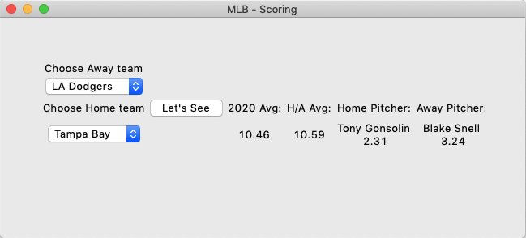

# MLB Scores and Pitching
Scraping MLB data from baseball-reference.com -- using it to predict runs and Pitcher's ERA, WHIP, SO/9

MLB Scores is a small project to predict MLB Score, Pitcher ERA's, WHIPs, and SO/9

* Web Scraping from baseball-reference.come
* Data Cleaning for the use of modeling
<b>
**TODO**
* Finish working with Scikit-learn to project which pitches a Pitcher uses most often
* Separate functions that decrease efficiency

Run MLB_Scores_GUI.py to run the simple Gui. 

  

